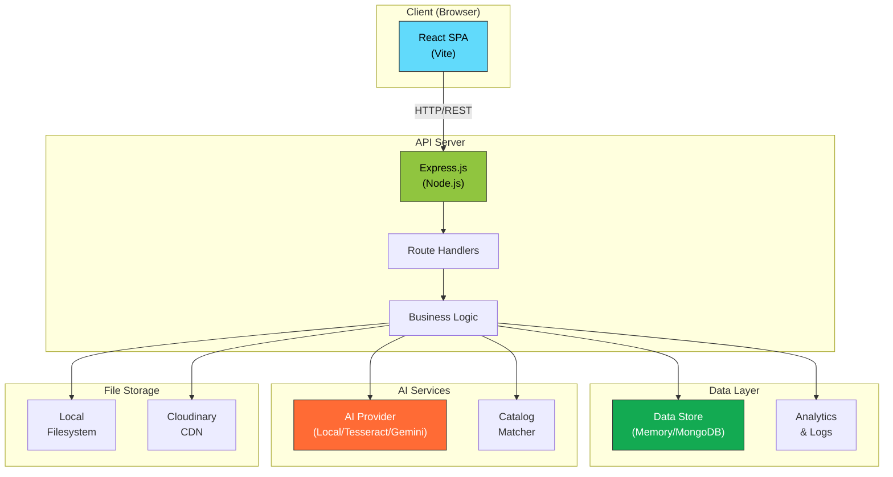
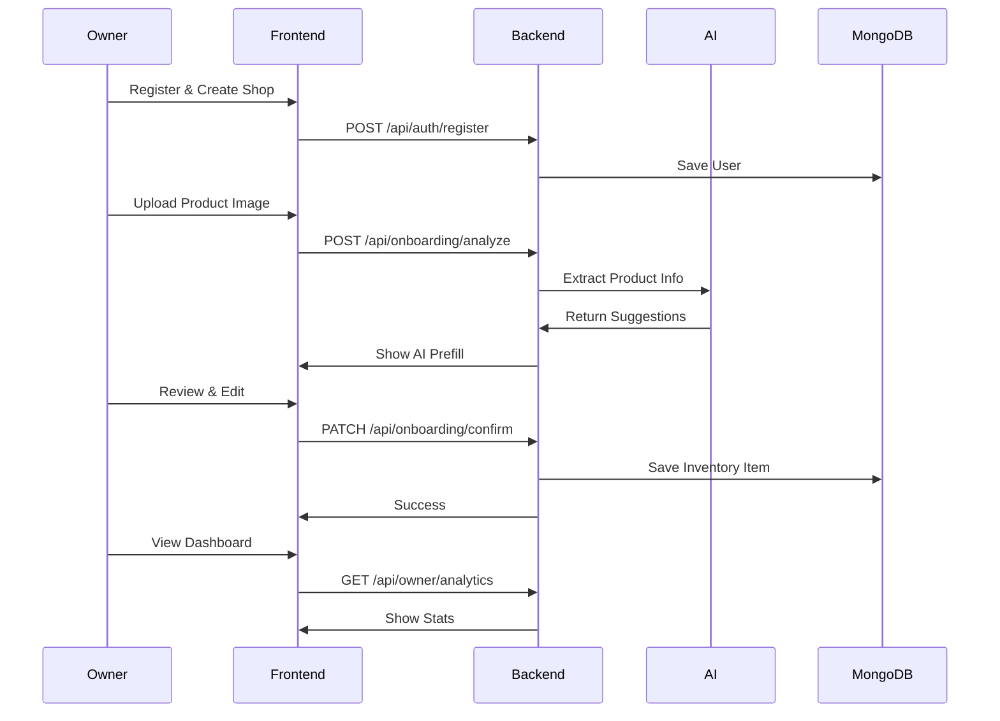
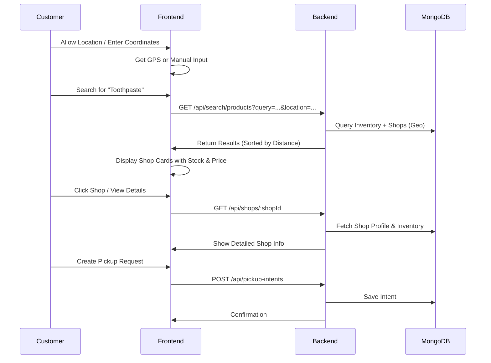

# 🏪 UrbnBzr - Hyperlocal Product Discovery Platform

> **Helping people find products in nearby local shops. Helping shop owners digitize inventory with AI.**

[](https://www.typescriptlang.org/)
[](https://react.dev/)
[](https://nodejs.org/)
[](https://www.mongodb.com/)
[](LICENSE)

---

## 📋 Table of Contents

- [Overview](#-overview)
- [Key Features](#-key-features)
- [Project Structure](#-project-structure)
- [Quick Start](#-quick-start)
- [Architecture](#-architecture)
- [Core Flows](#-core-flows)
- [API Documentation](#-api-documentation)
- [Configuration](#-configuration)
- [Development](#-development)
- [Deployment](#-deployment)
- [Database](#-database)
- [Contributing](#-contributing)

---

## 🎯 Overview

**UrbnBzr** is a full-stack hyperlocal discovery platform that connects customers with nearby local shops and helps shop owners digitize their inventory with AI assistance.

### The Vision
- **For Shop Owners**: Quickly add products to inventory with AI-assisted onboarding (no manual data entry)
- **For Customers**: Discover nearby shops, check real-time availability, and create pickup requests
- **For Small Retailers**: Compete with larger chains by going digital effortlessly

### MVP Scope (Live)
- ✅ Owner authentication & shop registration
- ✅ AI-assisted product onboarding with image upload
- ✅ Location-based product search
- ✅ Shop profiles with analytics
- ✅ Pickup intent system (reserve & pickup)
- ✅ MongoDB persistence
- ✅ React-based frontend

### Out of Scope (MVP)
- ❌ Delivery logistics
- ❌ Online payments
- ❌ Real-time hardware sync
- ❌ Ratings & reviews
- ❌ Chat/support flows

---

## ✨ Key Features

<details open>
<summary><b>🤖 AI-Assisted Product Onboarding</b></summary>

Owners upload a product image and AI automatically extracts:
- Product name & brand
- Category & pricing hints
- Stock information

The owner reviews and confirms before saving.

**Supported AI Providers:**
- Local AI (free, no API key)
- Tesseract OCR
- Google Gemini Vision

</details>

<details>
<summary><b>📍 Location-Based Search</b></summary>

Customers search for products and see results filtered by:
- Proximity (configurable radius)
- Real-time availability
- Pricing comparison across shops

Uses GeoJSON for efficient geo-spatial queries.

</details>

<details>
<summary><b>🏪 Shop Management Dashboard</b></summary>

Shop owners can:
- Manage shop profile & location
- Add/edit/delete inventory
- View analytics (views, clicks, search hits)
- Handle pickup intents

</details>

<details>
<summary><b>💾 Flexible Storage**</b></summary>

**Data Storage:**
- In-memory (development/demo)
- MongoDB (production)

**File Storage:**
- Local filesystem
- Cloudinary CDN

</details>

<details>
<summary><b>🔐 Secure Authentication**</b></summary>

- Password hashing with bcryptjs
- JWT token-based auth
- Owner-only protected routes
- Role-based access control

</details>

---

## 📁 Project Structure

```
UrbnBzr/
├── BACKEND/                          # Node.js + Express API
│   ├── src/
│   │   ├── app.ts                   # Express app setup
│   │   ├── server.ts                # Server entry point
│   │   ├── config.ts                # Configuration management
│   │   │
│   │   ├── routes/                  # API route handlers
│   │   │   ├── auth.routes.ts       # Authentication endpoints
│   │   │   ├── owner.routes.ts      # Owner/shop management
│   │   │   ├── shops.routes.ts      # Public shop endpoints
│   │   │   ├── search.routes.ts     # Product search
│   │   │   ├── pickup.routes.ts     # Pickup intents
│   │   │   ├── onboarding.routes.ts # AI onboarding flow
│   │   │   └── catalog.routes.ts    # Product catalog
│   │   │
│   │   ├── services/                # Business logic
│   │   │   ├── auth.service.ts
│   │   │   ├── owner.service.ts
│   │   │   ├── shop.service.ts
│   │   │   ├── search.service.ts
│   │   │   ├── onboarding.service.ts
│   │   │   ├── upload.service.ts
│   │   │   │
│   │   │   ├── ai/                  # AI providers
│   │   │   │   ├── provider.ts      # Abstract base
│   │   │   │   ├── local-ai.provider.ts
│   │   │   │   ├── tesseract-ai.provider.ts
│   │   │   │   ├── gemini-vision.provider.ts
│   │   │   │   ├── catalog-matcher.ts
│   │   │   │   └── image-source.ts
│   │   │   │
│   │   │   └── storage/             # Storage providers
│   │   │       ├── provider.ts      # Abstract base
│   │   │       ├── local-storage.provider.ts
│   │   │       └── cloudinary-storage.provider.ts
│   │   │
│   │   ├── data/                    # Data layer
│   │   │   ├── memory-store.ts      # In-memory storage
│   │   │   ├── mongo-store.ts       # MongoDB adapter
│   │   │   ├── mappers.ts           # Data mappers
│   │   │   └── seed.ts              # Demo data seeding
│   │   │
│   │   ├── middleware/              # Express middleware
│   │   │   ├── auth.middleware.ts
│   │   │   ├── error-handler.ts
│   │   │   ├── rate-limit.ts
│   │   │   ├── request-logger.ts
│   │   │   └── security.middleware.ts
│   │   │
│   │   ├── utils/                   # Helper functions
│   │   │   ├── api-error.ts
│   │   │   ├── auth.ts
│   │   │   ├── geo.ts               # Geospatial helpers
│   │   │   ├── logger.ts
│   │   │   └── pagination.ts
│   │   │
│   │   └── tests/                   # Test suite
│   │       └── api.test.ts
│   │
│   ├── docs/
│   │   ├── product_scope.md         # MVP scope & goals
│   │   ├── user_flow.md             # Core user journeys
│   │   └── database_schema.md       # Data model & collections
│   │
│   ├── package.json
│   ├── tsconfig.json
│   ├── compose.yml                  # Docker Compose config
│   ├── Dockerfile
│   └── README.md
│
├── FRONTEND/                         # React + Vite SPA
│   ├── src/
│   │   ├── main.jsx                 # Entry point
│   │   │
│   │   ├── components/              # React components
│   │   │   ├── Navbar/
│   │   │   ├── Sidebar/
│   │   │   ├── LocationSelector/
│   │   │   ├── SplashScreen/
│   │   │   └── ui/                  # Reusable UI components
│   │   │
│   │   ├── pages/                   # Page components
│   │   │   ├── Auth.jsx             # Login/Register
│   │   │   ├── Buyer/               # Customer pages
│   │   │   └── Seller/              # Owner pages
│   │   │
│   │   ├── context/                 # React Context
│   │   │   ├── AuthContext.jsx
│   │   │   ├── LocationContext.jsx
│   │   │   └── ThemeContext.jsx
│   │   │
│   │   ├── hooks/                   # Custom hooks
│   │   │   └── useUserLocation.js
│   │   │
│   │   ├── lib/                     # Utilities
│   │   │   ├── api.js               # API client
│   │   │   ├── routes.js
│   │   │   ├── format.js
│   │   │   └── location.js
│   │   │
│   │   ├── layouts/                 # Layout components
│   │   ├── styles/                  # Global styles
│   │   ├── test/                    # Test setup
│   │   └── assets/
│   │
│   ├── package.json
│   ├── vite.config.js
│   ├── vitest.config.js
│   ├── eslint.config.js
│   ├── index.html
│   └── README.md
│
└── README.md                         # This file

```

---

## 🚀 Quick Start

### Prerequisites
- **Node.js** 18+ 
- **npm** or **yarn**
- **MongoDB** (optional, for production data mode)
- **Git**

### Backend Setup

```bash
cd BACKEND

# Install dependencies
npm install

# Create environment file (copy from .env.example if available)
cp .env.example .env

# Start development server
npm run dev
```

Backend runs on **http://localhost:4000**

#### Available Scripts
```bash
npm run dev          # Start dev server with hot reload
npm run build        # Compile TypeScript to JavaScript
npm start            # Run compiled server (from dist/)
npm run typecheck    # Check TypeScript types without building
npm test             # Run test suite
```

### Frontend Setup

```bash
cd FRONTEND

# Install dependencies
npm install

# Start development server
npm run dev
```

Frontend runs on **http://localhost:5173** (Vite default)

#### Available Scripts
```bash
npm run dev          # Start Vite dev server
npm run build        # Build optimized production bundle
npm run preview      # Preview production build locally
npm run lint         # Run ESLint
npm test             # Run Vitest test suite
```

### Full Stack (Docker)

```bash
# From project root
docker-compose -f BACKEND/compose.yml up -d
```

---

## 🏗️ Architecture



### Technology Stack

| Layer | Technology | Version |
|-------|-----------|---------|
| **Frontend** | React | 19.2+ |
| **Frontend Build** | Vite | 8.0+ |
| **Backend** | Express.js | 4.21+ |
| **Runtime** | Node.js | 18+ |
| **Language** | TypeScript | 5.8+ |
| **Database** | MongoDB | 7.2+ |
| **Auth** | JWT + bcryptjs | - |
| **Storage** | Cloudinary/Local | - |
| **Testing** | Vitest/Supertest | - |

---

## 🔄 Core Flows

### Flow 1: Shop Owner Onboarding



<details>
<summary><b>📝 Step-by-Step Guide</b></summary>

1. **Register & Create Shop**
   - Owner registers with email/phone + password
   - Creates shop with name, type, address, location
   - Receives JWT token for authenticated requests

2. **Upload & Analyze**
   - Owner uploads product image
   - AI extracts name, brand, category, pricing
   - Backend returns confidence scores

3. **Review & Confirm**
   - Owner reviews AI-filled fields
   - Edits any incorrect information
   - Confirms to save to inventory

4. **View Analytics**
   - Dashboard shows views, clicks, search hits
   - Inventory list shows all products
   - Owner can edit/delete products anytime

</details>

### Flow 2: Customer Product Discovery



<details>
<summary><b>📝 Step-by-Step Guide</b></summary>

1. **Share Location**
   - Customer allows GPS or manually enters location
   - Frontend stores location context

2. **Search Products**
   - Type product name (e.g., "toothpaste")
   - Backend searches inventory + filters by radius
   - Results sorted by distance, then price

3. **View Details**
   - Click shop to see full profile
   - See all products from that shop
   - Check ratings & analytics (if available)

4. **Create Pickup Request**
   - Select product quantity
   - Add optional note/preferences
   - Owner receives notification
   - Status updates (pending → confirmed)

</details>

---

## 📡 API Documentation

### Base URL
```
http://localhost:4000/api
```

### Authentication
All owner-protected endpoints require:
```
Authorization: Bearer <JWT_TOKEN>
```

---

### Health Endpoints

<details>
<summary><b>GET /health</b></summary>

Check if server is running.

**Response:**
```json
{ "status": "ok" }
```

</details>

<details>
<summary><b>GET /health/ready</b></summary>

Check if server and database are ready.

**Response:**
```json
{ "status": "ready", "database": "connected" }
```

</details>

---

### Authentication Endpoints

<details>
<summary><b>POST /auth/register</b></summary>

Register a new user (owner or customer).

**Request:**
```json
{
  "fullName": "Rajesh Kumar",
  "email": "rajesh@example.com",
  "phone": "9876543210",
  "password": "SecurePass123",
  "role": "owner"
}
```

**Response:** `201 Created`
```json
{
  "user": { "id": "...", "email": "...", "role": "owner" },
  "token": "eyJhbGc..."
}
```

</details>

<details>
<summary><b>POST /auth/login</b></summary>

Login existing user.

**Request:**
```json
{
  "email": "rajesh@example.com",
  "password": "SecurePass123"
}
```

**Response:** `200 OK`
```json
{
  "user": { "id": "...", "email": "...", "role": "owner" },
  "token": "eyJhbGc..."
}
```

</details>

<details>
<summary><b>GET /auth/me</b></summary>

Get current authenticated user.

**Headers:**
```
Authorization: Bearer <TOKEN>
```

**Response:** `200 OK`
```json
{
  "id": "...",
  "fullName": "Rajesh Kumar",
  "email": "rajesh@example.com",
  "role": "owner"
}
```

</details>

---

### Owner Endpoints (Protected)

<details>
<summary><b>POST /owner/shop</b></summary>

Create a new shop (owner only).

**Request:**
```json
{
  "name": "Rajesh Kirana Store",
  "type": "kirana",
  "phone": "9876543211",
  "contactName": "Rajesh",
  "address": "123 Market Road",
  "location": { "type": "Point", "coordinates": [77.1234, 28.5678] },
  "serviceRadiusKm": 2
}
```

**Response:** `201 Created`
```json
{
  "id": "...",
  "ownerUserId": "...",
  "name": "Rajesh Kirana Store",
  "slug": "rajesh-kirana-store",
  "status": "active"
}
```

</details>

<details>
<summary><b>GET /owner/shop</b></summary>

Get owner's shop profile.

**Response:** `200 OK`
```json
{
  "id": "...",
  "name": "Rajesh Kirana Store",
  "type": "kirana",
  "location": { "type": "Point", "coordinates": [...] },
  "metricsSummary": {
    "views": 150,
    "clicks": 45,
    "searchHits": 30
  }
}
```

</details>

<details>
<summary><b>GET /owner/inventory</b></summary>

List all products in owner's shop.

**Query Params:**
- `page=1` - Pagination
- `limit=20` - Results per page

**Response:** `200 OK`
```json
{
  "items": [
    {
      "id": "...",
      "displayName": "Colgate Toothpaste",
      "price": 75,
      "mrp": 99,
      "quantity": 50,
      "imageUrls": ["..."]
    }
  ],
  "total": 145,
  "page": 1
}
```

</details>

<details>
<summary><b>POST /owner/inventory</b></summary>

Add product to inventory (manual entry).

**Request:**
```json
{
  "catalogProductId": "...",
  "displayName": "Colgate Toothpaste",
  "price": 75,
  "mrp": 99,
  "quantity": 50,
  "imageUrls": ["..."]
}
```

**Response:** `201 Created`

</details>

<details>
<summary><b>PATCH /owner/inventory/:productId</b></summary>

Update inventory item.

**Request:**
```json
{
  "quantity": 45,
  "price": 70
}
```

**Response:** `200 OK`

</details>

<details>
<summary><b>DELETE /owner/inventory/:productId</b></summary>

Remove product from inventory.

**Response:** `204 No Content`

</details>

<details>
<summary><b>GET /owner/analytics</b></summary>

Get shop analytics & metrics.

**Response:** `200 OK`
```json
{
  "views": 150,
  "clicks": 45,
  "searchHits": 30,
  "inventoryCount": 145,
  "lastInventoryUpdateAt": "2026-01-15T10:30:00Z"
}
```

</details>

<details>
<summary><b>GET /owner/pickup-intents</b></summary>

List pickup requests for owner's shop.

**Query Params:**
- `status=pending` - Filter by status

**Response:** `200 OK`
```json
[
  {
    "id": "...",
    "productId": "...",
    "customerName": "John Doe",
    "customerPhone": "9876543210",
    "quantityRequested": 2,
    "status": "pending",
    "createdAt": "2026-01-15T10:30:00Z"
  }
]
```

</details>

<details>
<summary><b>PATCH /owner/pickup-intents/:intentId</b></summary>

Update pickup intent status.

**Request:**
```json
{ "status": "confirmed" }
```

**Response:** `200 OK`

</details>

---

### Public Endpoints (No Auth Required)

<details>
<summary><b>GET /search/products</b></summary>

Search products by location & query.

**Query Params:**
- `query` - Product name (required)
- `lat`, `lng` - Coordinates (required)
- `radius` - Search radius in km (default: 2)
- `page` - Pagination (default: 1)

**Example:**
```
GET /search/products?query=toothpaste&lat=28.5678&lng=77.1234&radius=2
```

**Response:** `200 OK`
```json
{
  "results": [
    {
      "inventoryItemId": "...",
      "productName": "Colgate Toothpaste",
      "price": 75,
      "shop": {
        "id": "...",
        "name": "Rajesh Kirana",
        "distance": 0.5
      }
    }
  ]
}
```

</details>

<details>
<summary><b>GET /shops</b></summary>

List nearby shops.

**Query Params:**
- `lat`, `lng` - Coordinates (required)
- `radius` - Search radius in km

**Response:** `200 OK`
```json
[
  {
    "id": "...",
    "name": "Rajesh Kirana Store",
    "address": "123 Market Road",
    "distance": 0.5,
    "metricsSummary": { "views": 150, ... }
  }
]
```

</details>

<details>
<summary><b>GET /shops/:shopId</b></summary>

Get shop details.

**Response:** `200 OK`
```json
{
  "id": "...",
  "name": "Rajesh Kirana Store",
  "address": "123 Market Road",
  "phone": "9876543211",
  "inventory": [...]
}
```

</details>

<details>
<summary><b>POST /pickup-intents</b></summary>

Create a pickup request (customer).

**Request:**
```json
{
  "shopId": "...",
  "inventoryItemId": "...",
  "customerName": "John Doe",
  "customerPhone": "9876543210",
  "quantityRequested": 2,
  "note": "Available after 6 PM"
}
```

**Response:** `201 Created`
```json
{
  "id": "...",
  "status": "pending",
  "createdAt": "..."
}
```

</details>

---

## ⚙️ Configuration

### Environment Variables

Create a `.env` file in `BACKEND/` directory:

```bash
# Server
PORT=4000
NODE_ENV=development

# Database Mode
DATA_STORE_MODE=memory              # or 'mongo'
MONGODB_URI=mongodb://localhost:27017/urbnbzr
MONGODB_SEED_ON_START=true

# JWT
JWT_SECRET=your-super-secret-key-change-in-production
JWT_EXPIRY=7d

# File Storage
FILE_STORAGE_PROVIDER=local         # or 'cloudinary'
UPLOAD_DIR=./uploads

# Cloudinary (if using cloudinary storage)
CLOUDINARY_CLOUD_NAME=your-cloud-name
CLOUDINARY_API_KEY=your-api-key
CLOUDINARY_API_SECRET=your-api-secret

# AI Provider
AI_PROVIDER=local                   # or 'tesseract' or 'gemini'
GEMINI_API_KEY=your-gemini-api-key-if-using-gemini

# Rate Limiting
RATE_LIMIT_WINDOW=15m
RATE_LIMIT_MAX_REQUESTS=100

# CORS
CORS_ORIGIN=http://localhost:5173
```

### Data Store Modes

<details>
<summary><b>📦 In-Memory (Development)</b></summary>

```bash
DATA_STORE_MODE=memory
```

- ✅ No database setup required
- ✅ Instant startup
- ✅ Demo data preloaded
- ❌ Data lost on restart
- **Use for:** Local development, demos, testing

</details>

<details>
<summary><b>🗄️ MongoDB (Production)</b></summary>

```bash
DATA_STORE_MODE=mongo
MONGODB_URI=mongodb://localhost:27017/urbnbzr
MONGODB_SEED_ON_START=true
```

- ✅ Persistent storage
- ✅ Scalable queries
- ✅ Advanced filtering (geo-spatial, full-text search)
- ✅ Backups & replication support
- **Use for:** Production, staging

**Local MongoDB Setup:**
```bash
# Using Docker
docker run -d -p 27017:27017 --name mongodb mongo:7

# Or install locally: https://docs.mongodb.com/manual/installation/
```

</details>

### Storage Providers

<details>
<summary><b>💾 Local Storage</b></summary>

```bash
FILE_STORAGE_PROVIDER=local
UPLOAD_DIR=./uploads
```

- Files stored in `./uploads/`
- Served by Express static middleware
- ✅ No external dependencies
- ❌ Not ideal for distributed systems

</details>

<details>
<summary><b>☁️ Cloudinary Storage</b></summary>

```bash
FILE_STORAGE_PROVIDER=cloudinary
CLOUDINARY_CLOUD_NAME=your-cloud-name
CLOUDINARY_API_KEY=your-api-key
CLOUDINARY_API_SECRET=your-api-secret
```

- ✅ CDN-backed, fast delivery
- ✅ Automatic image optimization
- ✅ Cloud-safe, no server storage
- ❌ Requires paid account for production volumes
- **Sign up:** https://cloudinary.com

</details>

### AI Providers

<details>
<summary><b>🤖 Local AI (Default, Free)</b></summary>

```bash
AI_PROVIDER=local
```

- ✅ No API key required
- ✅ Works offline
- ⚠️ Less accurate than cloud providers
- **Best for:** Development, MVP testing

</details>

<details>
<summary><b>📝 Tesseract OCR</b></summary>

```bash
AI_PROVIDER=tesseract
```

- ✅ Open-source, free
- ✅ Good for text extraction
- ⚠️ Slower than cloud providers
- **Install:** `npm install tesseract.js`

</details>

<details>
<summary><b>🔥 Google Gemini Vision (Advanced)**</b></summary>

```bash
AI_PROVIDER=gemini
GEMINI_API_KEY=your-api-key
```

- ✅ State-of-the-art accuracy
- ✅ Multi-modal understanding
- ❌ Requires API key & credits
- **Get API Key:** https://ai.google.dev

</details>

---

## 👨‍💻 Development

### Code Standards

- **Language:** TypeScript (strict mode)
- **Linter:** ESLint
- **Formatter:** Prettier (enforced via pre-commit)
- **Testing:** Vitest (frontend), Supertest (backend)

### Running Tests

```bash
# Backend tests
cd BACKEND
npm test

# Frontend tests
cd FRONTEND
npm test
```

### TypeScript Checking

```bash
cd BACKEND
npm run typecheck

cd FRONTEND
npm run typecheck  # or npm run lint
```

### Project Conventions

<details>
<summary><b>📂 File Naming</b></summary>

- **Components:** PascalCase + `.jsx`
  - `UserCard.jsx`, `ProductSearch.jsx`
- **Utilities:** camelCase + `.js`
  - `formatPrice.js`, `validateEmail.js`
- **Services:** camelCase + `.service.ts`
  - `auth.service.ts`, `search.service.ts`
- **Types:** PascalCase + `.types.ts`
  - `User.types.ts`, `Shop.types.ts`

</details>

<details>
<summary><b>🗂️ Service Layer Pattern</b></summary>

```typescript
// services/myfeature.service.ts
export class MyFeatureService {
  async doSomething(input: InputType): Promise<OutputType> {
    // Business logic here
    // Use repository/data layer for data access
    // Use providers for external services
  }
}

// routes/myfeature.routes.ts
router.post('/my-endpoint', async (req, res) => {
  const service = new MyFeatureService(store);
  const result = await service.doSomething(req.body);
  res.json(result);
});
```

</details>

<details>
<summary><b>⚠️ Error Handling</b></summary>

```typescript
import { ApiError } from '../utils/api-error';

// Throw errors with appropriate HTTP status
throw new ApiError('Invalid input', 400);
throw new ApiError('Unauthorized', 401);
throw new ApiError('Not found', 404);
throw new ApiError('Server error', 500);

// All errors caught by error-handler middleware
// Returns consistent JSON error response
```

</details>

### Local Development Workflow

```bash
# 1. Start MongoDB (if using)
docker run -d -p 27017:27017 --name mongodb mongo:7

# 2. Terminal 1: Start backend
cd BACKEND
npm install
npm run dev

# 3. Terminal 2: Start frontend
cd FRONTEND
npm install
npm run dev

# 4. Open browser: http://localhost:5173
```

---

## 📦 Deployment

### Building for Production

**Backend:**
```bash
cd BACKEND
npm run build        # Creates dist/ folder
npm start            # Runs from dist/
```

**Frontend:**
```bash
cd FRONTEND
npm run build        # Creates dist/ folder
npm run preview      # Preview build locally
```

### Docker Deployment

```bash
# Build image
docker build -t urbnbzr-backend -f BACKEND/Dockerfile BACKEND/

# Run container
docker run -p 4000:4000 \
  -e NODE_ENV=production \
  -e MONGODB_URI=mongodb://db:27017/urbnbzr \
  urbnbzr-backend
```

### Environment-Specific Configs

<details>
<summary><b>Development</b></summary>

```bash
NODE_ENV=development
DATA_STORE_MODE=memory
DEBUG=true
```

</details>

<details>
<summary><b>Staging</b></summary>

```bash
NODE_ENV=staging
DATA_STORE_MODE=mongo
MONGODB_URI=mongodb://staging-server/urbnbzr
FILE_STORAGE_PROVIDER=cloudinary
AI_PROVIDER=gemini
```

</details>

<details>
<summary><b>Production</b></summary>

```bash
NODE_ENV=production
DATA_STORE_MODE=mongo
MONGODB_URI=<secure-mongo-uri>
MONGODB_REPLICAS=3
FILE_STORAGE_PROVIDER=cloudinary
AI_PROVIDER=gemini
JWT_SECRET=<strong-secret>
RATE_LIMIT_MAX_REQUESTS=1000
```

</details>

---

## 🗄️ Database

### Collections Overview

| Collection | Purpose | Key Fields |
|-----------|---------|-----------|
| `users` | Auth & identity | email, phone, passwordHash, role |
| `shops` | Shop profiles | ownerUserId, location (GeoJSON), serviceRadiusKm |
| `catalog_products` | Product master | canonicalName, brand, category, unit |
| `inventory_items` | Shop inventory | shopId, catalogProductId, price, quantity |
| `ai_onboarding_sessions` | AI suggestions | shopId, status, rawOcrText, analysis |
| `search_logs` | Demand tracking | query, location, selectedShopId |
| `analytics_events` | Interaction logs | eventType, shopId, catalogProductId |
| `pickup_intents` | Pickup requests | shopId, customerUserId, status |

### Indexes

All collections have optimized indexes for:
- Search queries
- Geo-spatial lookups
- Sorting & filtering
- Foreign key relationships

See [database_schema.md](./BACKEND/docs/database_schema.md) for details.

### Seeding Demo Data

```bash
# On first startup with MongoDB
MONGODB_SEED_ON_START=true npm run dev

# Seeds:
# - 50 catalog products
# - 10 shops across different locations
# - 100+ inventory items
# - Sample users
```

---

## 🤝 Contributing

### Getting Started

1. **Fork the repository** (if external contributor)
2. **Create a feature branch:**
   ```bash
   git checkout -b feature/my-feature
   ```
3. **Make changes & test locally**
4. **Commit with clear messages:**
   ```bash
   git commit -m "feat: add new feature"
   git commit -m "fix: resolve bug in search"
   git commit -m "docs: update README"
   ```
5. **Push & create Pull Request**

### Commit Message Format

Follow conventional commits:
```
feat:     New feature
fix:      Bug fix
docs:     Documentation
style:    Code style (no logic change)
refactor: Code restructure (no feature change)
perf:     Performance improvement
test:     Test addition/modification
chore:    Build, dependencies, tooling
```

### Code Review Checklist

- [ ] TypeScript types are correct
- [ ] No console.logs or debug code
- [ ] Tests pass (`npm test`)
- [ ] No security vulnerabilities
- [ ] Documentation updated
- [ ] Following project conventions

### Issues & Feature Requests

- **Report bugs:** Include reproduction steps & environment details
- **Request features:** Explain use case & expected behavior
- **Ask questions:** Use GitHub Discussions (if available)

---

## 📚 Documentation

<details>
<summary><b>📖 Available Docs</b></summary>

- [Backend README](./BACKEND/README.md) - Detailed backend setup
- [Frontend README](./FRONTEND/README.md) - Frontend setup & architecture
- [Product Scope](./BACKEND/docs/product_scope.md) - MVP definition & goals
- [User Flows](./BACKEND/docs/user_flow.md) - Core journeys & acceptance criteria
- [Database Schema](./BACKEND/docs/database_schema.md) - Data model & collections

</details>

---

## 🔒 Security

- ✅ JWT-based authentication
- ✅ Password hashing with bcryptjs
- ✅ CORS configured
- ✅ Rate limiting on sensitive endpoints
- ✅ Input validation & sanitization
- ✅ SQL/NoSQL injection prevention
- ⚠️ Review `.env` secrets before production deployment

---

## 📈 Performance

- **Search:** GeoJSON indexes enable fast location-based queries
- **Analytics:** Summary fields cached in shop document
- **Storage:** Cloudinary CDN for fast image delivery
- **Frontend:** Vite for instant HMR & optimized builds
- **Backend:** Middleware caching, pagination for large result sets

---

## 🐛 Troubleshooting

<details>
<summary><b>Backend won't start</b></summary>

```bash
# Check Node version
node --version  # Should be 18+

# Clear node_modules & reinstall
rm -rf node_modules package-lock.json
npm install

# Check port availability
lsof -i :4000  # If port in use, kill process or change PORT
```

</details>

<details>
<summary><b>MongoDB connection failed</b></summary>

```bash
# Verify MongoDB running
docker ps  # If using Docker

# Check connection string
echo $MONGODB_URI

# Test connection
mongosh "mongodb://localhost:27017"
```

</details>

<details>
<summary><b>Frontend not loading</b></summary>

```bash
# Check Vite dev server
# Usually runs on http://localhost:5173

# Try different port
npm run dev -- --port 3000

# Clear browser cache (Cmd+Shift+R or Ctrl+Shift+R)
```

</details>

<details>
<summary><b>API calls returning 401</b></summary>

- Ensure JWT token is being sent in Authorization header
- Check token expiration: `JWT_EXPIRY=7d`
- Verify token secret matches between generations and verification

</details>

---

## 📞 Support

- **Issues:** GitHub Issues
- **Discussions:** GitHub Discussions
- **Documentation:** See links in "Documentation" section above
- **Code Examples:** Check `/src/tests` for usage patterns

---

## 📄 License

MIT License - See LICENSE file (if present)

---

## 🙏 Acknowledgments

Built with ❤️ for local shopkeepers going digital.

Powered by:
- [Express.js](https://expressjs.com/) - Web framework
- [React](https://react.dev/) - Frontend framework
- [MongoDB](https://www.mongodb.com/) - Database
- [Vite](https://vitejs.dev/) - Build tool
- [TypeScript](https://www.typescriptlang.org/) - Type safety

---

<div align="center">

### ⭐ If you find this project useful, please consider giving it a star!

**[Report a Bug](../../issues/new?title=Bug:) · [Request a Feature](../../issues/new?title=Feature:) · [View Docs](./BACKEND/docs)**

</div>
